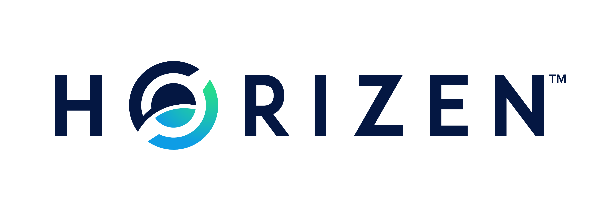

TODO
====

**Questions to clarify:**

-   Define the platform we want to use for the discussion of ZenIPs. Our
    existing community forum? This is crucial for the efficient
    communication and collaboration. See [Comment section](#zenip-comments)
    This section should be written from scratch!
-   Who will be the [Editors](#zenip-editors)?
-   Define [Process from proposed ZenIP draft to merge.](#specification-1) Intersection ZenIP and GitHub Process.
-   Additional criteria for rejection of ZenIP? [Fewer points maybe?](#reasons-for-rejection-of-zenips)
-   Other discussion guidelines than gnu?
-   Which [licenses](#zenip-licensing) do we want to require?
-   Adapt a modified version of Zcash NUP process?

**Tasks to do:**

-   Answer questions above and adapt document accordingly
-   Create/Merge ZenIP Repo
-   setup ZenIP related email address
-   "prepare" the forum/wiki/medium of choice for ZenIP related discussions
-   Follow through the ZenIP Process to adapt ZenIP-000, first testrun for the process suggested.

Everything in the following document written in **bold** font was added/annotated by Jonas.

* * * * *

# ZenIP-000

    ZenIP: 000
    Title: ZenIP Process
    Owners: Jonas Rubel, <jonas@zensystem.io>
    Status: Draft 
    Type: Process
    Created: 2019-08-18
    License: MIT

## Table of Contents

<!--ts-->
- [Terminology](#terminology)
- [Abstract](#abstract)
- [Copyright](#copyright)
- [Motivation](#motivation)
- [ZenIP Workflow](#zenip-workflow)
  * [Transferring ZenIP Ownership](#transferring-zenip-ownership)
  * [ZenIP Editors](#zenip-editors)
  * [ZenIP Editor Responsibilities and Workflow](#zenip-editor-responsibilities-and-workflow)
    + [Reasons for Rejection of ZenIPs](#reasons-for-rejection-of-zenips)
- [ZenIP Format and Structure](#zenip-format-and-structure)
  * [Specification](#specification)
    + [ZenIP Header Preamble](#zenip-header-preamble)
    + [Auxiliary Files](#auxiliary-files)
- [ZenIP Types](#zenip-types)
- [ZenIP Status Field](#zenip-status-field)
  * [Specification](#specification-1)
  * [Rationale](#rationale)
- [ZenIP Comments](#zenip-comments)
  * [Specification](#specification-2)
    + [Zcash Version](#zcash-version)
    + [Bitcoin Version](#bitcoin-version)
  * [Rationale](#rationale-1)
- [ZenIP Licensing](#zenip-licensing)
  * [Specification](#specification-3)
    + [Recommended Licenses](#recommended-licenses)
    + [Not recommended, but acceptable licenses](#not-recommended--but-acceptable-licenses)
    + [Not acceptable licenses](#not-acceptable-licenses)
  * [Rationale](#rationale-2)
- [See Also](#see-also)
- [References](#references)
<!--te-->

## Terminology

The key words "MUST", "SHOULD", "SHOULD NOT", "MAY", "RECOMMENDED",
"OPTIONAL", and "REQUIRED" in this document are to be interpreted as
described in [RFC 2119](https://tools.ietf.org/html/rfc2119).

The term "network upgrade" in this document is to be interpreted as
**???**

## Abstract

A Horizen Improvement Proposal (ZenIP) is a design document providing
information to the Horizen community, or describing a new feature for
Horizen or its processes or environment. The ZenIP should provide a
concise technical specification of the feature and a rationale for the
feature.

We intend ZenIPs to be the primary mechanism for proposing new features,
for collecting community input on an issue, and for documenting the
design decisions that have gone into Horizen. The Owner(s) of the ZenIP
(usually the authors(s)) are responsible for building consensus within
the community and documenting dissenting opinions.

Because the ZenIPs are maintained as text files in a versioned
repository, their revision history is the historical record of the
feature proposal.

This document is based on the work done by acityinohio, daira, and str4d
with [zip-0000](https://github.com/zcash/zips/blob/master/zip-0000.rst).
They themselves based their document partly on the work done by Luke
Dashjr with [BIP2](https://github.com/bitcoin/bips/blob/master/bip-0002.mediawiki).

## Copyright

This ZenIP is dual-licensed under the Open Publication License and BSD 2-clause license.
**Or MIT? Which license?**

## Motivation

It has been the stated goal of Horizen from the very beginning to build a decentralized platform, where not just the infrastructure is distributed, but also the funding and decision making. Part of the Horizen block subsidy goes to the Zen Blockchain Foundation treasury (at the time of writing - block 571074 - 20%), from where it get's distributed to fund the development of the protocol, the sidechain implementation, marketing as well as business development.

The ZenIP process will be an important step towards a decentralized decision making process for the Horizen ecosystem. Improvement Proposal processes have proven to work well for decentralized blockchain projects, hence it should be the best way to distribute influence and power towards the broader community of open source contributors and stakeholders. 

## ZenIP Workflow

The ZenIP process begins with a new idea for Horizen. Each potential
ZenIP must have an Owner -- someone who writes the ZenIP using the style
and format described below, shepherds the discussions in the appropriate
forums, and attempts to build community consensus around the idea. The
ZenIP Owner should first attempt to ascertain whether the idea is
ZenIP-able. Small enhancements or patches to a particular piece of
software often don't require standardisation between multiple projects;
these don't need a ZenIP and should be injected into the relevant
project-specific development workflow with a patch submission to the
applicable issue tracker.

**Include Link: See our GitHub Process for more information**

Additionally, many ideas have been brought forward for changing Horizen
that have been rejected for various reasons. The first step should be to
search past discussions to see if an idea has been considered before,
and if so, what issues arose in its progression. After investigating
past work, the best way to proceed is by posting about the new idea to
the [Horizen Community Forum](https://forum.horizen.global/).

**Which Platform do we want to use? Our Forum?"**

Vetting an idea publicly before going as far as writing a ZenIP is meant
to save both the potential Owner and the wider community time. Asking
the Horizen community first if an idea is original helps prevent too
much time being spent on something that is guaranteed to be rejected
based on prior discussions (searching the internet does not always do
the trick). It also helps to make sure the idea is applicable to the
entire community and not just the Owner. Just because an idea sounds
good to the Owner does not mean it will work for most people in most
areas where Horizen is used.

Once the Owner has asked the Horizen community as to whether an idea has
any chance of acceptance, a draft ZenIP should be presented to the
[Horizen Community Forum](https://forum.horizen.global/).

This gives the Owner a chance to flesh out the draft ZenIP to make it
properly formatted, of high quality, and to address additional concerns
about the proposal. Following a discussion, the proposal should be
submitted to the **ZenIP Git Repo link** as a pull request. This draft
must be written in ZenIP style as described below, and named with an
alias such as `ZenIP-zentoshizenamoto-42millionzen` until the ZenIP
Editors have assigned it a ZenIP number (Owners MUST NOT self-assign
ZenIP numbers).

ZenIP Owners are responsible for collecting community feedback on both
the initial idea and the ZenIP before submitting it for review. However,
wherever possible, long open-ended discussions on forums should be
avoided.

It is highly recommended that a single ZenIP contain a single key
proposal or new idea. The more focused the ZenIP, the more successful it
tends to be. If in doubt, split your ZenIP into several well-focused
ones.

**TODO PROCESS**

*When the ZenIP draft is complete, the ZenIP Editors will assign the
ZenIP a number, label it as Standards Track, Informational, or Process,
and merge the pull request to the ZenIPs git repository.*

The ZenIP Editors will not unreasonably reject a ZenIP. Reasons for
rejecting ZenIPs include duplication of effort, disregard for formatting
rules, being too unfocused or too broad, being technically unsound, not
providing proper motivation or not in keeping with the Horizen
philosophy. For a ZenIP to be accepted it must meet certain minimum
criteria. It must be a clear and complete description of the proposed
enhancement. The enhancement must represent a net improvement. The
proposed implementation, if applicable, must be solid and must not
complicate the protocol unduly.

The ZenIP Owner may update the draft as necessary in the git repository.
Updates to drafts should also be submitted by the Owner as pull
requests.

### Transferring ZenIP Ownership

It occasionally becomes necessary to transfer ownership of ZenIPs to a
new Owner. In general, we'd like to retain the original Owner as a
co-Owner of the transferred ZenIP, but that's really up to the original
Owner. A good reason to transfer ownership is because the original Owner
no longer has the time or interest in updating it or following through
with the ZenIP process, or has fallen off the face of the 'net (i.e. is
unreachable or not responding to email). A bad reason to transfer
ownership is because you don't agree with the direction of the ZenIP. We
try to build consensus around a ZenIP, but if that's not possible, you
can always submit a competing ZenIP.

If you are interested in assuming ownership of a ZenIP, send a message
asking to take over, addressed to both the original Owner and the ZenIP
Editors. If the original Owner doesn't respond to email in a timely
manner, the ZenIP Editors will make a unilateral decision (it's not like
such decisions can't be reversed :).

If an author of a ZenIP is no longer an Owner, an Original-Authors field
SHOULD be added to the ZenIP metadata indicating the original
authorship, unless the original author(s) request otherwise.

### ZenIP Editors

**TODO**

*The current ZenIP Editors are Daira Hopwood, representing the Electric
Coin Company, and George Tankersley, representing the Horizen
Foundation. Both can be reached at <ZenIPs@z.cash> . The current design
of the ZenIP Process dictates that there are always at least two ZenIP
Editors: one from the Electric Coin Company and one from the Horizen
Foundation. Additional Editors may be selected by consensus among the
current Editors.*

### ZenIP Editor Responsibilities and Workflow

The ZenIP Editors subscribe to the [Horizen Community
Forum.](https://forum.horizen.global) **Choose Platform, see above**

For each new ZenIP that comes in an Editor confirms the following:

-   Read the ZenIP to check if it is ready: sound and complete. The
    ideas must make technical sense, even if they don't seem likely to
    be accepted.
-   The title should accurately describe the content.
-   The ZenIP draft must have been sent to the Horizen Community Forum
    or as a PR to the **ZenIPs git repository link**
-   Motivation and backward compatibility (when applicable) must be
    addressed.
-   The licensing terms are acceptable for ZenIPs.

If the ZenIP isn't ready, the editor will send it back to the Owner for
revision, with specific instructions.

Once the ZenIP is ready for the repository it should be submitted as a
"pull request" to the **ZenIPs git repository link** where it may get
further feedback. It should not contain a ZenIP number, and should be
labelled "WIP" in the pull request.

The ZenIP Editors will:

-   Assign a ZenIP number in the pull request.
-   Merge the pull request when it is ready and remove the "WIP" label.

The ZenIP editors monitor ZenIP changes and update ZenIP headers as
appropriate.

#### Reasons for Rejection of ZenIPs

The ZenIP Editors MAY reject a proposed ZenIP or update to an existing
ZenIP for any of the following reasons:

-   it violates the Horizen Code of Conduct **link** ;
-   it appears too unfocused or broad;
-   it duplicates effort in other ZenIPs without sufficient technical justification
    (however, alternative proposals to address similar or overlapping problems
    are not excluded for this reason);
-   it has manifest security flaws (including being unrealistically dependent
    on user vigilance to avoid security weaknesses);
-   it disregards compatibility with the existing Horizen blockchain or ecosystem;
-   it is manifestly unimplementable;
-   it includes buggy code, pseudocode, or algorithms;
-   it manifestly violates common expectations of a significant portion of the
    Horizen community;
-   it updates a Draft ZenIP to Released when there is significant community
    opposition to its content (however, Draft ZenIPs explicitly may describe
    proposals to which there is, or could be expected, significant community
    opposition);
-   in the case of a Released ZenIP, the update makes a substantive change to
    which there is significant community opposition;
-   it is dependent on a patent that could potentially be an obstacle to
    adoption of the ZenIP;
-   it includes commercial advertising or spam;
-   it disregards formatting rules;
-   it makes non-editorial edits to previous entries in a ZenIP's Change history;
-   an update to an existing ZenIP extends or changes its scope to an extent
    that would be better handled as a separate ZenIP;
-   a new ZenIP has been proposed for a category that does not reflect its content,
    or an update would change a ZenIP to an inappropriate category;
-   it updates a Released ZenIP to Draft when the specification is already
    implemented and has been in common use;
-   it violates any specific "MUST" or "MUST NOT" rule in this document;
-   it is not authorized by the stated ZenIP Owners;
-   it removes an Owner without their consent (unless the reason for removal
    is directly related to a breach of the Code of Conduct by that Owner).

**additional criteria?**

The ZenIP Editors MUST NOT unreasonably deny publication of a ZenIP
proposal or update that does not violate any of these criteria. If they
refuse a proposal or update, they MUST give an explanation of which of
the criteria were violated, with the exception that spam may be deleted
without an explanation.

Note that it is not the primary responsibility of the ZenIP Editors to
review proposals for security, correctness, or implementability.

Please send all ZenIP-related communications either by email to
**address**, or by opening an issue on the **ZenIPs issue tracker +
link** . All communications should abide by the Horizen Code of Conduct
**LINK** and follow [the GNU Kind Communication
Guidelines](https://www.gnu.org/philosophy/kind-communication.en.html)

## ZenIP Format and Structure

### Specification

ZenIPs SHOULD be written either in [GitHub Flavored Markdown](https://github.github.com/gfm/),
[reStructuredText](http://docutils.sourceforge.net/rst.html) or [LaTeX](https://www.latex-project.org/). In the latter case, a Makefile MUST
be provided to build (at least) a PDF version of the document.

Each ZenIP SHOULD have the following parts:

-   Preamble -- Headers containing metadata about the ZenIP ([see
    below](#ZenIP-header-preamble)). The License field of the preamble
    indicates the licensing terms, which MUST be acceptable according to
    [the ZenIP licensing requirements](#ZenIP-licensing).
-   Terminology -- Definitions of technical or non-obvious terms used in
    the document.
-   Abstract -- A short (\~200 word) description of the technical issue
    being addressed.
-   Motivation -- The motivation is critical for ZenIPs that want to
    change the Horizen protocol. It should clearly explain why the
    existing protocol is inadequate to address the problem that the
    ZenIP solves.
-   Specification -- The technical specification should describe the
    interface and semantics of any new feature. The specification should
    be detailed enough to allow competing, interoperable implementations
    for any of the current Horizen platforms.
-   Rationale -- The rationale fleshes out the specification by
    describing what motivated the design and why particular design
    decisions were made. It should describe alternate designs that were
    considered and related work. The rationale should provide evidence
    of consensus within the community and discuss important objections
    or concerns raised during discussion.
-   Security and privacy considerations -- If applicable, security and
    privacy considerations should be explicitly described, particularly
    if the ZenIP makes explicit trade-offs or assumptions. For guidance
    on this section consider [RFC3552](https://tools.ietf.org/html/rfc3552) as a starting point.
-   Reference implementation -- Literal code implementing the ZenIP's
    specification, and/or a link to the reference implementation of the
    ZenIP's specification. The reference implementation must be
    completed before any ZenIP is given status “Implemented” or “Final”,
    but it generally need not be completed before the ZenIP is accepted
    into “Proposed”.

#### ZenIP Header Preamble

Each BIP must begin with an [RFC 822](https://www.ietf.org/rfc/rfc822.txt) style header preamble. The headers
must appear in the following order. Headers marked with "(\*)" are
optional and are described below. All other headers are required.

    ZenIP: ZenIP number, or "X" before being assigned
    (*) Layer: Consensus (soft fork) | Consensus (hard fork) | Peer Services | API/RPC | Applications **???**
    Title: ZenIP title; maximum 44 characters
    Owners: list of authors' names and email addresses
    (*) Discussions-To: email address
    (*) Comments-Summary: summary tone
    Comments-URI: links to wiki page for comments?
    Status: Draft | Active | Proposed | Deferred | Rejected |
             Withdrawn | Final | Replaced | Obsolete
    Type: Standards Track | Informational | Process
    Created: date created on, in ISO 8601 (yyyy-mm-dd) format
    License: abbreviation for approved license(s)
    (*) License-Code: abbreviation for code under different approved license(s)
    (*) Post-History: dates of postings to **Horizen mailing list ?**, or link to thread in mailing list archive
    (*) Requires: ZenIP number(s)
    (*) Replaces: ZenIP number
    (*) Superseded-By: ZenIP number

The Owners header lists the names and email addresses of all the Owners
of the ZenIP. The format of the Owners header value SHOULD be:

    Random J. User <address@dom.ain>

If there are multiple Owners, each should be on a separate line.

While a ZenIP is in private discussions (usually during the initial
Draft phase), a Discussions-To header will indicate the URL where the
ZenIP is being discussed. No Discussions-To header is necessary if the
ZenIP is being discussed privately with the Owner.

**TODO**

The Category header specifies the type of ZenIP: Consensus, Standards
Track, Informational, or Process.

The Created header records the date that the ZenIP was submitted. Dates
should be in yyyy-mm-dd format, e.g. 2001-08-14.

#### Auxiliary Files

ZenIPs may include auxiliary files such as diagrams. Auxiliary files
should be included in a subdirectory for that ZenIP; that is, for any
ZenIP that requires more than one file, all of the files SHOULD be in a
subdirectory named ZenIP-XXX.

Auxiliary files should be MUST be named ZenIP-XXX-Y.ext, where "XXX" is
the ZenIP number, "Y" is a serial number (starting at 1), and "ext" is
replaced by the actual file extension (e.g. "png").

## ZenIP Types

There are several types of ZenIP:

-   A Consensus ZenIP describes a change that affects the consensus
    protocol followed by all Horizen implementations.
-   A Standards Track ZenIP describes any non-consensus change that
    affects most or all Horizen implementations, such as a change to the
    network protocol, or any change or addition that affects the
    interoperability of applications using Horizen.

Consensus and Standards Track ZenIPs consist of two parts: a design
document and a reference implementation.

-   An Informational ZenIP describes Horizen design issues, or general
    guidelines or information for the Horizen community, that do not
    fall into either of the above categories. Informational ZenIPs do
    not necessarily represent a Horizen community consensus or
    recommendation, so users and implementers are free to ignore
    Informational ZenIPs or follow their advice.
-   A Process ZenIP describes a process surrounding Horizen, or proposes
    a change to (or an event in) a process. Process ZenIPs are like
    Standards Track ZenIPs but apply to areas other than the Horizen
    protocol itself. They may propose an implementation, but not to
    Horizen's codebase; they often require community consensus; unlike
    Informational ZenIPs, they are more than recommendations, and users
    are typically not free to ignore them. Examples include procedures,
    guidelines, changes to the decision-making process, and changes to
    the tools or environment used in Horizen development. 
    This ZenIP-000 is an example of a Process ZenIP.

New categories may be added by consensus among the ZenIP Editors.

## ZenIP Status

-   Draft: All initial ZenIP submissions have this status.
-   Withdrawn: If the Owner decides to remove the ZenIP from
    consideration by the community, they may set the status to
    Withdrawn.
-   Active: Typically only used for Process/Informational ZenIPs,
    achieved once rough consensus is reached in PR/forum posts from
    Draft Process ZenIP.
-   Proposed: Typically the stage after Draft, added to a ZenIP after
    consideration, feedback, and rough consensus from the community. The
    ZenIP Editors must validate this change before it is approved.
-   Rejected: The status when progress hasn't been made on the ZenIP in
    one year. Can revert back to Draft/Proposed if the Owner resumes
    work or resolves issues preventing consensus.
-   Implemented: When a Consensus or Standards Track ZenIP has a working
    reference implementation but before activation on the Horizen
    network.
-   Final: When a Consensus or Standards Track ZenIP is both implemented
    and activated on the Horizen network.
-   Obsolete: The status when a ZenIP is no longer relevant (typically
    when superseded by another ZenIP).

More details on the status workflow in the section below.

### Specification

**add simple graphic similar to example below**

Owners of a ZenIP may decide on their own to change the status between
Draft or Withdrawn.

A ZenIP may only change status from Draft (or Rejected) to Proposed,
when the Owner deems it is complete and there is rough consensus on the
forums, validated by **the Editors**. One Editor will not suffice --
there needs to be consensus among the Editors.

**Network Upgrade Pipeline (NUP) Process also interesting for Horizen?**

*If it's a Standards Track ZenIP, upon changing status to Proposed the
Editors will add the optional `Network Upgrade` header to the preamble,
indicating the intent for the ZenIP to be implemented in the specified
network upgrade. (All `Network Upgrade` schedules will be distributed
via the Horizen Community Forum by the Editors.)*

A Standards Track ZenIP may only change status from Proposed to
Implemented once the Owner provides an associated reference
implementation, typically in the period after the network upgrade's
specification freeze but before the implementation audit. If the Owner
misses this deadline, the Editors or Owner(s) may choose to update the
`Network Upgrade` header to target another upgrade, at their discretion.

ZenIPs should be changed from Draft or Proposed status, to Rejected
status, upon request by any person, if they have not made progress in
one year. Such a ZenIP may be changed to Draft status if the Owner
provides revisions that meaningfully address public criticism of the
proposal, or to Proposed status if it meets the criteria required as
described in the previous paragraph.

A Consensus or Standards Track ZenIP becomes Final when its associated
network upgrade or other protocol change is activated on Horizen's
mainnet.

A Process or Informational ZenIP may change status from Draft to Active
when it achieves rough consensus on the forum or PR. Such a proposal is
said to have rough consensus if it has been open to discussion on the
forum or GitHub PR for at least one month, and no person maintains any
unaddressed substantiated objections to it. Addressed or obstructive
objections may be ignored/overruled by general agreement that they have
been sufficiently addressed, but clear reasoning must be given in such
circumstances.

When an Active or Final ZenIP is no longer relevant, its status may be
changed to Obsolete. This change must also be objectively verifiable
and/or discussed. Final ZenIPs may be updated; the specification is
still in force but modified by another specified ZenIP or ZenIPs (check
the optional Updated-by header).

### Rationale

We want to define an unambiguous criteria for the Status field of BIPs, which has often been a source of confusion in similar Improvement Proposal processes. Many *X*-IPs with significant real-world use have been left as Draft or Proposed status longer than appropriate. By giving objective criteria to judge the progression of BIPs, this proposal aims to help keep the Status accurate and up-to-date.

This ZenIP does not aim to address what "should" be the basis of decisions. Such a statement, no matter how perfect in its justification, would be futile without some way to force others to use it. Opinions will always differ to some degree. The ZenIP process does not aim to be a kind of forceful "governance" of Horizen, merely to provide a collaborative repository for proposing and providing information on standards, which people may voluntarily adopt or not. It can only hope to achieve accuracy in regard to the "Status" field by striving to reflect the reality of *how things actually are*, rather than *how they should be*.

## ZenIP Comments

**Which one???**

### Specification

#### Zcash Version
Comments from the community on the ZenIP should occur on the [Horizen
Community Forum](https://forum.horizen.global) and the comment fields of the pull requests
in any open ZenIPs. Editors will use these sources to judge rough
consensus.

#### Bitcoin Version

Each ZenIP should, in its preamble, link to a **public wiki page** with a summary tone of the comments on that page. Reviewers of the ZenIP who consider themselves qualified, should post their own comments on this **wiki page**. The comments page should generally only be used to post final comments for a completed ZenIP. If a ZenIP is not yet completed, reviewers should instead post on the applicable **development mailing list thread** to allow the ZenIP author(s) to address any concerns or problems pointed out by the review.

To avoid a situation where critical ZenIP reviews may go unnoticed during this period, reviewers may, at their option, still post their review on the **comments page**, provided they first post it to the **mailing list** and plan to later remove or revise it as applicable based on the completed version. Such revisions should be made by editing the previous review and updating the timestamp. Reviews made prior to the complete version may be removed if they are no longer applicable and have not been updated in a timely manner (eg, within one month).

Pages must be named after the full ZenIP number (eg, "ZenIP-000") and placed in the "Comments" namespace. For example, the link for ZenIP-000 will be https://github.com/ZencashOfficial/ZenIP/wiki/Comments:ZenIP-000 .

Comments posted to this wiki should use the following format:

`<Your opinion> --<Your name>, <Date of posting, as YYYY-MM-DD>`

BIPs may also choose to list a second forum for BIP comments, in addition to the BIPs wiki. In this case, the second forum's URI should be listed below the primary wiki's URI.

After some time, the BIP itself may be updated with a summary tone of the comments. Summary tones may be chosen from the following, but this BIP does not intend to cover all possible nuances and other summaries may be used as needed:

* No comments yet.
* Unanimously Recommended for implementation
* Unanimously Discourage for implementation
* Mostly Recommended for implementation, with some Discouragement
* Mostly Discouraged for implementation, with some Recommendation

For example, the preamble to BIP 1 might be updated to include the line:

    Comments-Summary: No comments yet.
    Comments-URI: ZencashOfficial/ZenIP/wiki/Comments:ZenIP-000
                  https://some-other-wiki.org/ZenIP-000-Comments

These fields must follow the "Discussions-To" header defined in [ZenIP Format and Structure](#zenip-format-and-structure) (if that header is not present, it should follow the position where it would be present; generally this is immediately above the Status header).

To avoid doubt: comments and status are unrelated metrics to judge a ZenIP, and neither should be directly influencing the other.

### Rationale

**todo**

## ZenIP Licensing

**TODO**

### Specification

New ZenIPs may be accepted with the following licenses. Each new ZenIP
MUST identify at least one acceptable license in its preamble. Each
license MUST be referenced by their respective abbreviation given below.

For example, a preamble might include the following License header:

    License: BSD-2-Clause
             GNU-All-Permissive

In this case, the ZenIP text is fully licensed under both the
OSI-approved BSD 2-clause license as well as the GNU All-Permissive
License, and anyone may modify and redistribute the text provided they
comply with the terms of *either* license. In other words, the license
list is an "OR choice", not an "AND also" requirement.

It is also possible to license source code differently from the ZenIP
text. This case SHOULD be indicated in the Reference Implementation
section of the ZenIP. Again, each license MUST be referenced by its
respective abbreviation given below.

Statements of code licenses in ZenIPs are only advisory; anyone
intending to use the code should look for license statements in the code
itself.

ZenIPs are not required to be *exclusively* licensed under approved
terms, and MAY also be licensed under unacceptable licenses *in addition
to* at least one acceptable license. In this case, only the acceptable
license(s) should be listed in the License header.

#### Recommended Licenses

-   MIT: [Expat/MIT/X11 license](https://opensource.org/licenses/MIT)
-   BSD-2-Clause: [OSI-approved BSD 2-clause
    license](https://opensource.org/licenses/BSD-2-Clause)
-   BSD-3-Clause: [OSI-approved BSD 3-clause
    license](https://opensource.org/licenses/BSD-3-Clause)
-   CC0-1.0: [Creative Commons CC0 1.0
    Universal](https://creativecommons.org/publicdomain/zero/1.0/)
-   GNU-All-Permissive: [GNU All-Permissive
    License](http://www.gnu.org/prep/maintain/html_node/License-Notices-for-Other-Files.html)
-   Apache-2.0: [Apache License, version
    2.0](http://www.apache.org/licenses/LICENSE-2.0)

In addition, it is RECOMMENDED that literal code included in the ZenIP
be dual-licensed under the same license terms as the project it
modifies. For example, literal code intended for Horizend would ideally
be dual-licensed under the MIT license terms as well as one of the above
with the rest of the ZenIP text.

#### Not recommended, but acceptable licenses

-   BSL-1.0: [Boost Software License, version
    1.0](http://www.boost.org/LICENSE_1_0.txt)
-   CC-BY-4.0: [Creative Commons Attribution 4.0
    International](https://creativecommons.org/licenses/by/4.0/)
-   CC-BY-SA-4.0: [Creative Commons Attribution-ShareAlike 4.0
    International](https://creativecommons.org/licenses/by-sa/4.0/)
-   AGPL-3.0+: [GNU Affero General Public License (AGPL), version 3 or
    newer](http://www.gnu.org/licenses/agpl-3.0.en.html)
-   FDL-1.3: [GNU Free Documentation License, version
    1.3](http://www.gnu.org/licenses/fdl-1.3.en.html)
-   GPL-2.0+: [GNU General Public License (GPL), version 2 or
    newer](http://www.gnu.org/licenses/old-licenses/gpl-2.0.en.html)
-   LGPL-2.1+: [GNU Lesser General Public License (LGPL), version 2.1 or
    newer](http://www.gnu.org/licenses/old-licenses/lgpl-2.1.en.html)

#### Not acceptable licenses

All licenses not explicitly included in the above lists are not
acceptable terms for a Horizen Improvement Proposal.

### Rationale

## See Also

-   [The GNU Kind Communication
    Guidelines](https://www.gnu.org/philosophy/kind-communication.en.html)
-   [RFC 7282: On Consensus and Humming in the
    IETF](https://tools.ietf.org/html/rfc7282)
-   [Horizen Network Upgrade
    Pipeline](https://electriccoin.co/blog/the-Horizen-network-upgrade-pipeline/)

## References

[1]: [Key words for use in RFCs to Indicate Requirement
    Levels](https://tools.ietf.org/html/rfc2119)

[2]: \_[GitHub Flavored Markdown](https://github.github.com/gfm/)

[3]: [reStructuredText
    documentation](http://docutils.sourceforge.net/rst.html)

[4]: [LaTeX -- a document preparation
    system](https://www.latex-project.org/)
